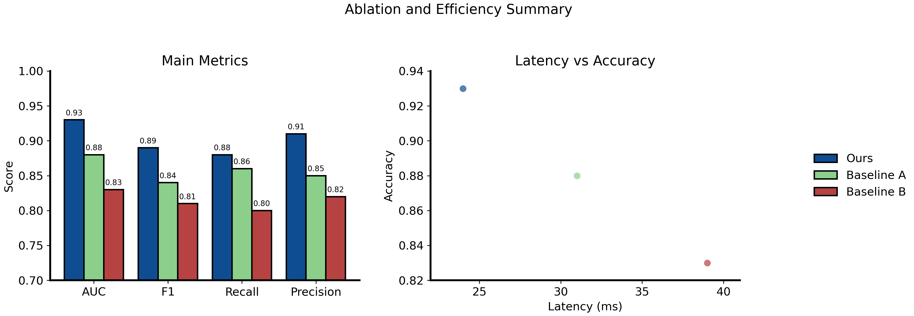

# Engineering Figure Agent

<div align="center">


**Agent-native figure production for engineering and CS papers.**

Conceptual diagrams use `image mode`; exact quantitative figures use `plot mode`.

[Main README](./README.md) | [中文说明](./README.zh-CN.md) | [Example Gallery](./docs/examples/README.md) | [Showcase](./docs/showcase.md)

</div>

## Preview

| System Architecture | Cooperative Perception | Safety Taxonomy |
|---|---|---|
|  |  |  |

| Dense Overview | Exact Local Plot |
|---|---|
|  |  |

## When To Use

| Need | Recommended path |
|---|---|
| System architecture, algorithm workflow, graphical abstract, hardware block diagram | `image mode` |
| Benchmark bars, ablation plots, trend curves, heatmaps, scatter plots | `plot mode` |
| Mixed conceptual and quantitative figure | Render exact plot panels locally, then handle conceptual panels separately |
| Planning before generation | Start with a `figure brief` |

## Quick Start

Install and check:

```powershell
& "$HOME/.codex/skills/engineering-figure-agent/scripts/install_and_test.ps1" -RunSetupCheck
```

Build a prompt without any network call:

```powershell
python "$HOME/.codex/skills/engineering-figure-agent/scripts/efa.py" prompt `
  --figure-template system-architecture `
  --lang en `
  "A retrieval-augmented generation system with OCR, chunking, embedding, vector search, reranking, and answer synthesis."
```

Render an exact plot:

```powershell
python "$HOME/.codex/skills/engineering-figure-agent/scripts/efa.py" plot `
  "$HOME/.codex/skills/engineering-figure-agent/docs/examples/benchmark-plot-request.json" `
  --out-path output/benchmark-plot
```

## Workflow

1. Create or normalize a figure brief: goal, claim, figure type, panels, labels, data, style, and verification checklist.
2. Choose mode: conceptual structure uses `image`; exact numeric geometry uses `plot`.
3. Generate the image prompt or plot request.
4. Verify labels, arrows, hierarchy, numeric values, axes, legends, and paper-claim alignment.

## Platform Adapters

| Platform | Entry | Use |
|---|---|---|
| Codex | `SKILL.md` | Primary local agent workflow |
| Claude Code | `adapters/claude-code/` | Local project figure brief, prompt, and plot workflows |
| ChatGPT / Claude web | `docs/prompt-pack.md` | Copy-paste prompt workflows |
| VS Code / Obsidian | `templates/figure-brief/` | Store briefs, prompts, and plot requests |

Core contracts:

- `references/figure-brief-spec.md`
- `schemas/figure-brief.schema.json`
- `schemas/plot-request.schema.json`

## Providers

| Backend | Use |
|---|---|
| Gemini / Banana-compatible | Conceptual figure generation and reference-image edits |
| OpenAI Image API | OpenAI-style conceptual figure generation and edits |
| Local plot | Exact numeric charts |

Keep real API keys outside the repository. Enable `NANOBANANA_ALLOW_THIRD_PARTY=1` only when you intentionally trust a third-party relay.

## Boundaries

- Not a full web platform.
- Not a replacement for paper-claim reasoning or reviewer-style figure critique.
- Does not invent experiment values, hardware parameters, or performance gains.
- Never use image generation for exact chart values, axes, or benchmark geometry.

## Repository Map

| Path | Purpose |
|---|---|
| `SKILL.md` | Codex skill core rules |
| `scripts/` | Prompt building, image generation, plotting, checks, and unified CLI |
| `references/` | Templates, provider rules, high-res policy, Chinese labels, and plot rules |
| `docs/examples/` | Example outputs, prompts, and figure briefs |
| `templates/figure-brief/` | Platform-neutral figure brief templates |
| `adapters/` | Claude Code and future adapters |

## License

MIT License. See [LICENSE](./LICENSE).
