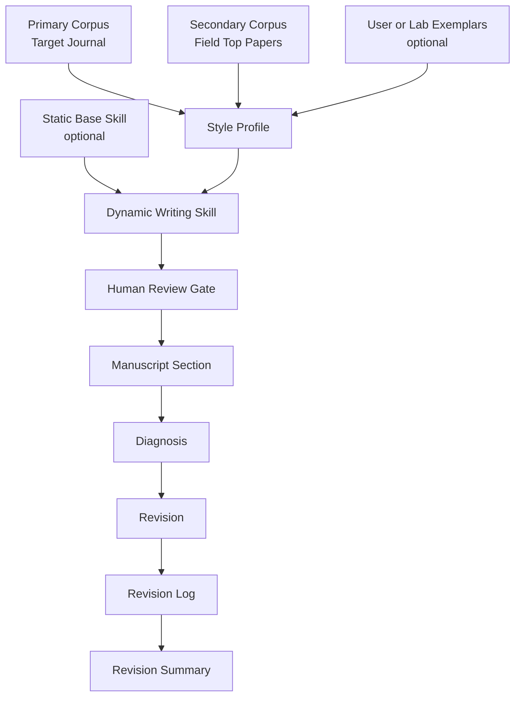

# System Architecture

**Project:** journal-adapt  
**Public version:** 1.1  

journal-adapt is a dynamic academic writing skill framework. It combines optional static writing rules with corpus-derived writing signals, then generates a temporary skill for revising one manuscript.

---

## 1. Layered Model

```text
Layer 1: Static Base Skill Layer
  Optional discipline, lab, or general academic writing rules

Layer 2: Corpus Signal Layer
  Primary target-journal corpus
  Optional field-top or topic-similar corpus
  Optional user/lab exemplars

Layer 3: Dynamic Skill Layer
  Weighted style profile
  Conflict table
  Section-specific revision guidance

Layer 4: Manuscript Revision Layer
  Diagnosis
  Section-by-section revision
  Revision log
```

The static layer is reusable. The dynamic layer is generated for one writing destination and one manuscript context.

---

## 2. Data Flow



Phase 1 produces the dynamic writing skill. Phase 2 uses only that skill and the manuscript section being revised.

---

## 3. Corpus Roles

| Role | Weight | Required? | Purpose |
|------|--------|-----------|---------|
| Primary corpus | Highest | Yes | Captures the target journal's local writing conventions. |
| Secondary corpus | Medium | Optional | Adds field-top or topic-similar writing quality when target-journal evidence is thin. |
| User/lab exemplars | Low to medium | Optional | Captures preferred author, advisor, or lab style. |

The primary corpus should usually decide journal-fit questions. Secondary corpus files and user/lab exemplars are optional. They should not override strong target-journal signals unless the user explicitly chooses that behavior.

---

## 4. Priority Rules

```text
P1 Hard Preserve
  Facts, claims, citations, equations, notation, variables, numerical results,
  figure/table labels, and author-defined terms.

P2 Target Journal Strong Signals
  Recurrent writing patterns from the primary corpus.

P3 Secondary Corpus / Exemplar Signals
  High-quality writing patterns from top-field or topic-similar papers,
  plus optional user, advisor, or lab preferences.

P4 Static Base Skill Rules
  Optional discipline, lab, or general writing rules.

P5 Cleanup Rules
  Anti-AI phrasing, hollow transitions, generic contributions, and unsupported overclaims.
```

P1 always wins. P2 usually beats P3 and P4. P3 beats P4 only when the secondary corpus or exemplar signal is relevant and not contradicted by the target journal.

---

## 5. Human Review Gates

The workflow is designed to stay auditable.

| Gate | Human checks |
|------|--------------|
| Corpus selection | Papers are legally accessible, relevant, and appropriate for the writing goal. |
| Style cards | No quotes, no paraphrases, no copied findings from corpus papers. |
| Style profile | Signal labels are plausible and not overread. |
| Dynamic writing skill | Rules do not ask the agent to invent facts or expose private manuscript content. |
| Revision output | Technical content is preserved and edits improve the intended writing fit. |

The agent should not proceed from Phase 1 to Phase 2 until the dynamic skill has been reviewed.

---

## 6. Anti-Plagiarism Boundary

When reading corpus papers, the system may extract:

- section architecture;
- rhetorical moves;
- contribution placement;
- tense and voice patterns;
- recurring writing patterns across papers;
- patterns absent from the corpus.

The system must not output:

- direct quotes from corpus papers;
- paraphrased sentences;
- named findings, results, or statistics from corpus papers;
- any sentence that could substitute for the source paper's prose.

The corpus teaches writing structure, not content.

---

## 7. Why Phase 2 Does Not Re-read the Corpus

Once the dynamic writing skill is generated and reviewed, Phase 2 should load only:

1. the dynamic writing skill,
2. the manuscript section,
3. the relevant revision log template.

This keeps the context small and prevents the revision step from copying or paraphrasing corpus papers.
