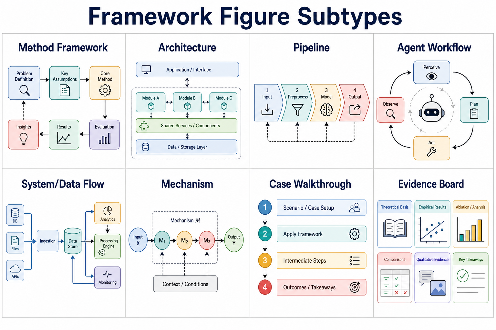
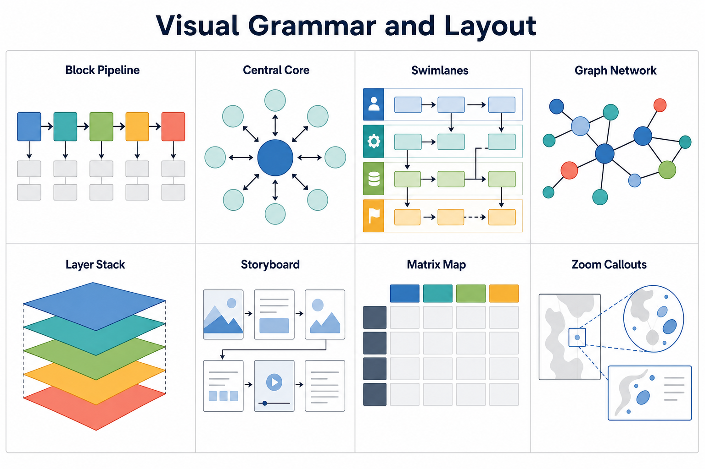
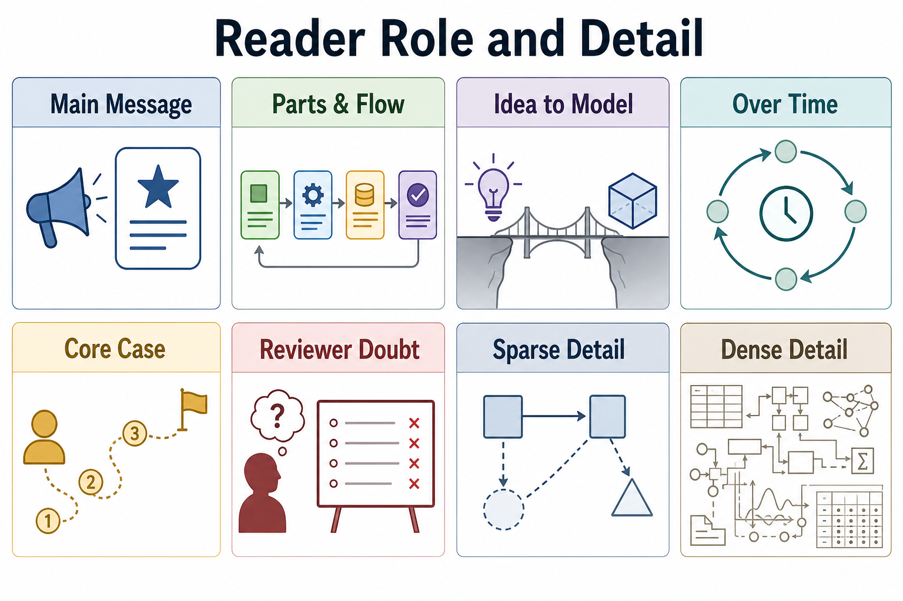
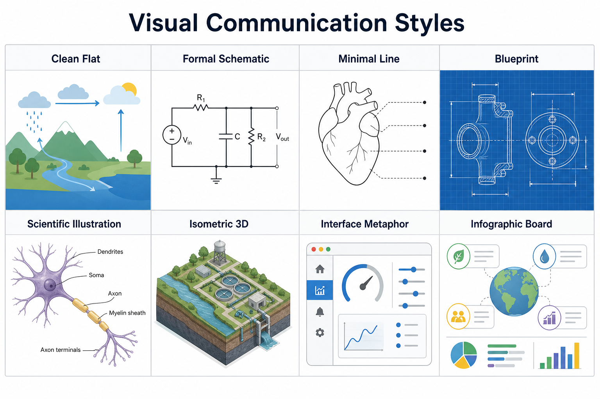

# Paper Framework Figure

`paper-framework-figure` is a specialized skill for publication-ready research-paper framework diagrams: method overviews, architecture diagrams, pipeline/process figures, agent workflows, system/data-flow figures, mechanism-intuition diagrams, case walkthroughs, and reviewer-facing schematics.

This version was regenerated from `research-paper-figure-skill-factory` v2.0.5. Skill version: v2.5.0.

## Main Rules

- Startup is plan-only and displays the saved subtype/style atlas boards with Markdown image embeds.
- Text turns that explain abstract visual decisions must embed a saved reference image or non-target concept/modeling example image.
- Text turns that explain visual structure, layout skeleton, panel choreography, module topology, arrow grammar, candidate-board structure, second-round optimization geometry, or content architecture must embed a saved reference or non-target visual-structure image. Prose-only structure descriptions are not valid.
- Target-paper candidate images, second-round variants, draft figures, final figures, and revisions stay in dedicated `IMAGE_ONLY` turns.
- First-round candidates maximize direction-level diversity.
- After P6 selects the current best first-round direction, P6b/P6b-IMAGE/P6c are mandatory before P7.

## Saved Atlas

The package includes saved reference boards:

## Workflow

1. S0: startup plan and saved atlas display only.
2. P1: target-paper material intake.
3. P2: figure-need diagnosis and subtype routing with reference/concept/structure display.
4. P3: reader effect and 4-6 text candidates, normally 6.
5. P4: first-round board setup with required visual-structure image display.
6. P5: `IMAGE_ONLY` first-round diverse candidate generation.
7. P6: first-round review and current-best direction selection.
8. P6b: paper-local second-round setup with required optimization-structure image display.
9. P6b-IMAGE: `IMAGE_ONLY` second-round variant generation.
10. P6c: second-round review and final direction lock.
11. P7: final prompt/brief after P6c.
12. P8: `IMAGE_ONLY` formal generation or revision.
13. P9: critique, caption, legend, and body-text package.

Rendering route: ChatGPT web uses Create image through ChatGPT Images 2.0. Codex uses `$imagegen` first, then ChatGPT Images 2.0 API or another approved image API only if needed.
